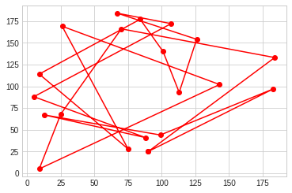
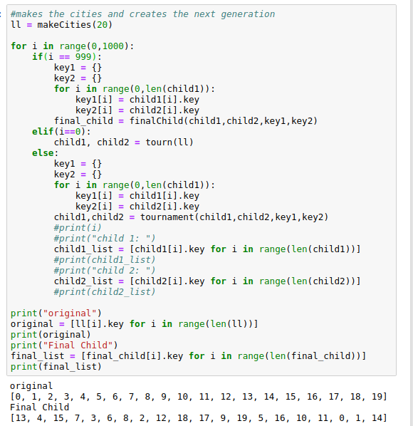

# CSCI-4610 Artificial Intelligence: Assignment 2

We implemented a genetic algorithm that solves the _Travelling Salesman Problem_ using Python.  

Group Members:

* Jude Arokiam
* Mitchell Childerhose
* Shayne Taylor

_NOTE: All group work was equally distributed through group meetings and pair programming. Commit log is not a good representation of work done._

## Genetic Algorithm

### 1. Initialization

An initial population is created using `class cities` which requires the x and y coordinates and a key value. The function `makeCities` will randomly generate _n_ objects of cities. 

### 2. Evaluation

To evaluate each member of the population we use the functions: `distance` and `fitness`. The distance function calculates the distance a city has between all other cities in the population. The fitness function uses the distance function to get the distance and then calculates to inverse distance. From these distances we can assign a score that is given by the `totalDistance` function.

### 3. Selection

We had two options when choosing how we would select individuals in a population. The first was go through every member and calculate the score. Since we would have to compare each member to every other member the complexity would be **n^2**. Upon doing research we stumbled upon an approximation method called tournament style that randomly selects _k_ individual each generation. We decided this would be better for us due to computational restrictions. The downside to this method is that there is a chance that the global maximum will not be reached and we would not have the best route.

### 4. Crossover and Mutation

To create new individuals we take the top individuals based on our fitness function and score and take half of the routes and swap with another city. To add an element of randomness we then shuffle the routes.

### 5. Termination

The GA is get to terminate when 1000 generations have been produced. Our initial plan was to have the GA generate generations until a threshold value that represented the change in performance between the nth generation and the n-1th generation was met. We found that the convergence was not occurring after a long period of time so turned to a upper limit of generations that could be run.

## Case Study: 20 Random Cities

20 cities are randomly generated on a 200x200 grid. Using our genetic algorithm (GA) we compute distance and produce the optimal route to visit all cities without visiting each one more than once.

 

As you can see in the graph that our GA does not produce the optimal route. As a human looking at the points, it is easy to see that a circular or bow-tie shaped route should be the most optimal. While we are not able to achieve this, our GA does show some signs of being able to produce this. There are about 4 circular paths that occur before going to a city that is farther away. This tells us that it may be possible to improve performance by tweaking the fitness function or running more generations.

